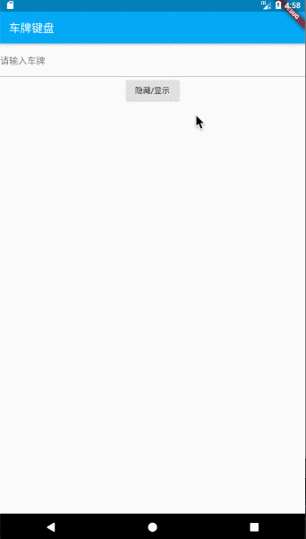

# vehicle_keyboard
[](https://pub.flutter-io.cn/packages/vehicle_keyboard)

专为提高中国车牌号码输入速度而定制开发的专用键盘组件。

欢迎大家提出宝贵的意见

## Getting Started

### Add dependency

```yaml
dependencies:
    vehicle_keyboard: ^0.0.2 #latest version

```

## Example




```dart
import 'package:vehicle_keyboard/vehicle_keyboard.dart';

class SecondScreenState extends State<SecondScreen> {
  bool showKeyboard = false;

  TextEditingController controller = new TextEditingController();


  /// 键盘的整体回调，根据不同的按钮事件来进行相应的逻辑实现
  void _onKeyDown(KeyDownEvent data) {
    debugPrint("keyEvent:" + data.key);

    if (data.isClose() || data.isCommit()) {
      setState(() {
        showKeyboard = false;
      });
    }
  }

  @override
  Widget build(BuildContext context) {
    //设置适配尺寸 (填入设计稿中设备的屏幕尺寸)
    ScreenUtil.instance = ScreenUtil(width: 1080, height: 1920)..init(context);
    return new Scaffold(
      appBar: new AppBar(
        title: new Text('车牌键盘'),
        backgroundColor: Colors.lightBlue,
      ),
      body: new Center(
          child: Column(
        children: <Widget>[
          TextField(
            decoration: InputDecoration(
              border: UnderlineInputBorder(),
              labelText: '请输入车牌',
            ),
            controller: controller,
            focusNode: FocusNode(canRequestFocus: false),
            onTap: () {
              setState(() {
                showKeyboard = true;
              });
            },
          ),
          RaisedButton(
            child: Text("隐藏/显示"),
            onPressed: () {
              setState(() {
                showKeyboard = !showKeyboard;
              });
            },
          )
        ],
      )),
      bottomNavigationBar: showKeyboard ? VehicleKeyboard(_onKeyDown,controller) : null,
    );
  }
}
```


